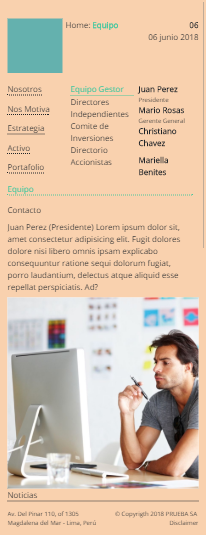

# Reto Circuit
## **Descripcion del proyecto:**
  - Este proyecto contiene un pagina web con submenus hecha como reto para la empresa circuit.

## **Herramientas utilizadas:**
  - HTML5
  - CSS3
  - Jquery
  - Bootstrap

